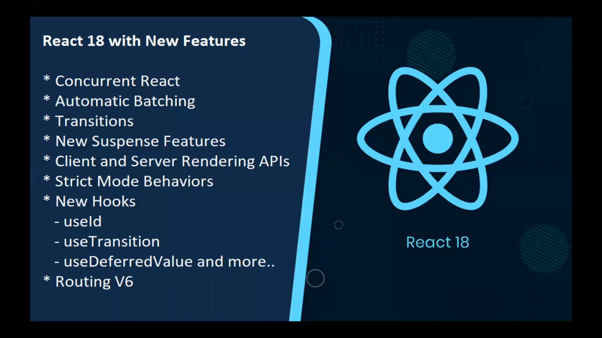

# 01. Intro

---

PRE-REQUISITES:

- HTML
- CSS
- JS

<aside>
💡

A React Developer should have knowledge of both JS & TS

- This course covers required TS
- An MERN Stack APP will also be covered
</aside>

## What is React and Why we need React..?

- Before addressing this, We need to know Challenges in Modern Web Development

## Challenges in Modern Web Development

1. Unified User Experience [ UX ] → Providing Same seamless, consistent Behavior/Experience/Functionalities across all the devices, Platforms etc..
    - Earlier, Applications running on Mobile Devices will have limited functionalities/Experience due to Scaling down the app to optimize for Mobiles
    - Due to these differences in mobile & desktop versions of same app, User Experience is effected
2. Fluid UX → Interactions and transitions within an application/website are smooth, seamless, and consistent.
3. Loosely Coupled & Extensible
    - **Loosely Coupled** → refers to a design principle where components /modules of a system are Less dependent on each other.
        - This means that changes in one component have little or no impact on other components,
    - **Extensible** →  Easy addition/Extension of new features without modifying existing features

The above challenges are faced in Modern Web Development 

- as more than 80% of Modern Web Users are using Web from wide range of Smart Devices

## Solution to these Challenges

- Better to build SPA [ Single Page Application ]
- EX:
    - Previously, in the Index Page, we will see Login & Register Options
        - If we select Login, It will redirect from Index page to Login page
        - If we select Register, It will redirect from Index page to Register page
    - But with SPA, Both Login & Register functionalities won’t be Page but a Components
        - Hence, they can be included in the Index page itself
        - Since, Web Components can be included in a web page
    - This component based inclusion on home page is NOT a new thing
        - The HTML input tag with date type is a component → we will get a calendar to pick the date
        - The HTML input tag with color type is a component → we will get a color picker to pick the date
        - There will be separate component code to each of these input tags, which can be seen by enabling shadow DOM button in developer tool settings

## Can’t we build SPA using JS & jQuery

- Yes, we can build
- But, there are several issues like
    - LOT of DOM Manipulations
    - LOT of Event Handling
    - LOT of Coding
    - Explicit AJAX

## Solution

- Hence, It is better to use Library or Framework
    - like React, Angular, Vue, Knockout etc..

Hence, we are learning React

<aside>
💡

NOTE:

- Twitter is the world’s FIRST SPA [ Even before React & Angular ]
</aside>

---

A React Dev should have idea on these Tools/Tool_Chains

