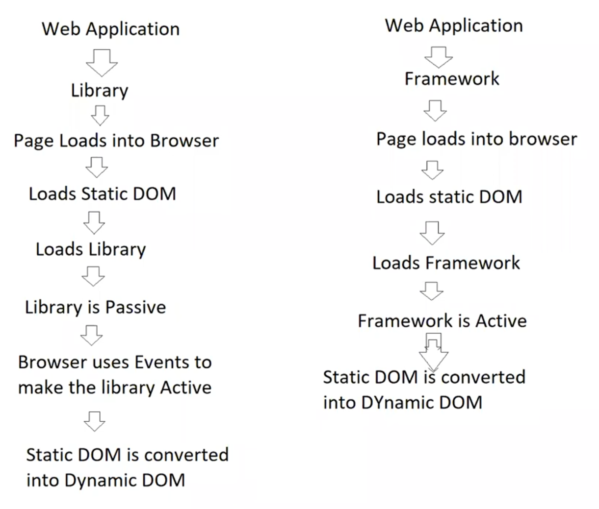

# 02. React (vs) Angular

---

## Difference between Angular & React

- `React` → A JS library for building UI
- `Angular` → A Developer’s Platform & a Framework
    - Developer’s Platform → Provides End to End solution
    - i.e., it provides platform for development, debugging, Testing & Deployment

<aside>
💡

**`Library`** → Provides collection of pre-written code with which developers can perform tasks[ without writing code from scratch] 

- It is a collection of functions, classes etc..

`Framework` → standardized structure that provides a platform on which developers can build software applications.

- It is a collection of tools, libraries etc..
</aside>

## Library (vs) Framework

- **`Control`**:
    - With a library, you controls the flow of the application.
    - With a framework, framework controls the flow of application
- **`Inversion of Control`**:
    - A framework dictates the architecture of your application and calls your code when needed.
        - i.e., you plug your code into a framework & framework calls it when needed
    - In a Library, You plug in the library functions/classes within your code & you calls it when needed
- Summary:
    - Library is used to build the app [ But CANNOT control the flow of App ]
        - like Library doesn’t do when to add/update/modify/collect value & we have to do that manually using set of Events
    - Framework is used to build the app & control the flow of app
        - It does all the things using MVC without explicit use of Events

## How the Flow works between them

- When you use a Library & build the app, then the flow will be like
    1. Browser loads the page
    2. loads the Static DOM
    3. Loads the Library [ Module Systems loads the Library ]
    4. But library will be Passive [ Not Active ]
    5. Browser uses Events to make Library Active
    6. Then, Static DOM is converted into Dynamic DOM by Library
- But in terms of Framework,
    - A Framework is always active
    - Hence, no need of events to convert the Static DOM to Dynamic DOM
    - A Framework directly converts the Static DOM to Dynamic DOM

This is beautifully demonstrated in the class using jQuery & Angular

## What is React

- React is a JS Library for building user interfaces
- It is used to build SPA & Effective UI’s

## Features of React

1. Component Based
    - Easy to build Interfaces
    - Easy to Re-Use
    - Faster Build Times
    - Loosely Coupled & Extensible
2. Uses Modular Library [ JS itself modular ]
    - `Modular library` -  loads only the required function/module etc.. from the library
        - It uses Dependency Injection & Lazy Loading
    - `Legacy library` → loads the whole library instead of the required function/component
    - loads Application specific library
        - Hence, Improves performance of app
        - and App becomes light weight
3. Asynchronous Library
    - Implicitly uses Ajax
    - New details will be added without reloading the complete page
4. Uses Virtual DOM

## Where to use React & Angular

- React → When there is a Framework already & only needs frontend UI
- Angular → If you don’t have a framework (or) you want purely client-side based application rather than server-side