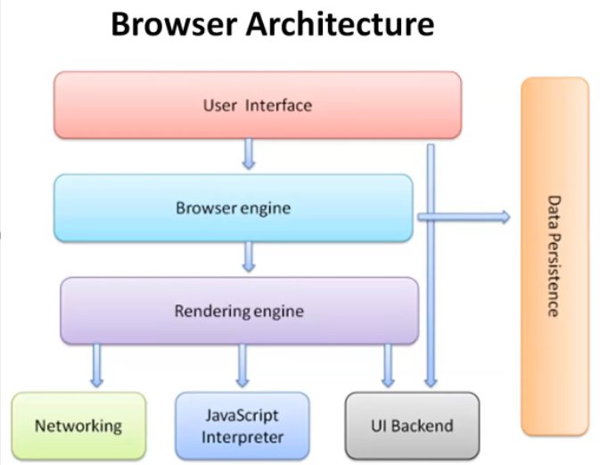

# 03. Browser & VDOM

---

## What is DOM

- DOM is the Hierarchy of Elements present in the Browser

## Why Same HTML Code works differently in different Browsers

- Because, Each Browser is built on different Engines
- Rendering of the HTML page by these Engines is different
- Hence, Different Output is displayed on Web Page

## Architecture of Browser

## Workflow of Browser

1. HTML code will be converted into Byte Code [ Machine Code ]
2. From Machine Code, Characters are generated [ like ‘<’, ‘b’, ‘o’ etc.. ]
3. From characters, Tokens are generated [ like ‘
’, <body>’ etc.. ]
4. From Tokens, Nodes/Elements are Generated [ each tag is a Node ] 
5. From Nodes, DOM is Generated [ Nodes are Arranged into Hierarchical Order ]
6. Based on DOM, A Layout is Generated
7. Now Rendering Engine will paint this Layout with Rendered Elements
8. Finally, Painted Output is displayed on the Web Page

Layout → Prototype of the page to be displayed 

- The browser calculates the position and size of each element on the screen.
- This step is also known as "reflow.”

Rendering → Generating Output [ Done by Rendering Engine ]

Painting → Displaying the Rendered Elements on a web page

1. First fills in the pixels for each element
2. Layers all the elements together to produce final Output on Screen

- Once `Render Tree` is Generated, Then only Layout is formed/Created/Generated
- Once Layout is Generated, The Painting happens which is render each element & it’s pixel & the output is generated

<aside>
💡

NOTE:

- PROCESS
    - Network will transfer the data [ through packets ]
    - DOM is the Result of HTML
        - DOM is constructed Incrementally on the GO
        - HTML —> Bytes —> Chars —> Tokens —> Nodes —> DOM
    - CSSOM is the Result of CSS
        - CSS —> Bytes —> Chars —> CSSOM
    - Once both DOM & CSSOM are successfully completed/Generated, A Render Tree will be Generated
- Checkout the Performance tab from Developer Tools
    - Each of this process is recorded in there
</aside>

## What is Shadow DOM..?

- Shadow DOM is a [ hidden ] DOM under any specific element
    - It allows developers to encapsulate a part of the DOM into a separate, isolated "shadow tree" within a regular DOM tree.
    - This encapsulation ensures that the “shadow tree” is hidden from the rest of the page and does not interfere with the main DOM.
    - This Shadow DOM has a Root called Shadow Root [ which is The Entry point to this Shadow DOM ]
    - It Follows a Root & Shadow Hierarchy of Building a Component
- It is part of DOM only, but is Hidden && won’t interfere with actual DOM

- Benefits:
    - Isolation
    - Works as a component → Reusability, Modular
    - Encapsulation → Maintainability
- EX:
    - Input tag with type “file”
    - Input tag with type “date”

<aside>
💡

NOTE:

- DOM is for Web Page
- Shadow DOM is for the Components in Web Page
</aside>

## What is Virtual DOM

- The virtual DOM is a Virtual representation of the real DOM kept in memory
    - Interacting & Updating the real DOM is slow & performance costly
    - Hence, React uses VDOM,
        - which is light weight,
        - Interacting & Updating the VDOM is fast & increases performance
- `Diffing Algo` → Comparing the current & previous versions of VDOM & identifying the changes
- `Reconciliation` → Process of Identifying the changes to VDOM & updating/rendering only those changes to DOM
    - It only re-renders the parts of the UI that have changed, instead of the whole UI
    - React uses `ReactDOM` library for this reconciliation

<aside>
💡

Actual def:

- `virtual DOM` is a programming concept where a “virtual” representation of a UI is kept in memory and is synced with the “real” DOM by a library such as ReactDOM.
- This process is called reconciliation.
</aside>

## Working of VDOM

1. **Step 1 – Initial Rendering**: 
    - when the app starts,
    - the entire UI is represented as a Virtual DOM.
    - React elements are created and rendered into the virtual structure.
2. **Step 2 – State and Props Changes**: 
    - as the states and props change in the app,
    - React re-renders the affected components in the virtual DOM.
    - These changes do not immediately impact the real DOM.
3. **Step 3 – Comparison Using Diff Algorithm**: 
    - React then uses a **diffing algorithm** to compare the current version of the Virtual DOM with the previous version.
    - This process identifies the differences (or "diffs") between the two versions.
4. **Step 4 – Reconciliation Process**: 
    - based on the differences identified, React determines the most efficient way to update the real DOM.
    - Only the parts of the real DOM that need to be updated are changed, rather than re-rendering the entire UI.
    - This selective updating is quick and performant.
5. **Step 5 – Update to the Real DOM**: 
    - finally, React applies the necessary changes to the real DOM.
    - This might involve adding, removing, or updating elements based on the differences detected in step 3.

<aside>
💡

NOTE:

---

- In a React app, the UI elements **displayed to the user** are the **Actual DOM**.
- However, React uses a **Virtual DOM** to efficiently manage and update the Actual DOM.
</aside>

## Some Important Points regarding VDOM

- The Virtual DOM Is a Browser Feature [ NO, DOM is a Browser feature ]
- The Virtual DOM Replaces the Real DOM [ NO, Only updates to DOM are managed by VDOM ]
- React is the Only Library and Framework that Uses the Virtual DOM [ NO, VueJS, SolidJS also uses it ]
- The Virtual DOM Solves All Performance Problems [ No, It significantly increases the performance ]