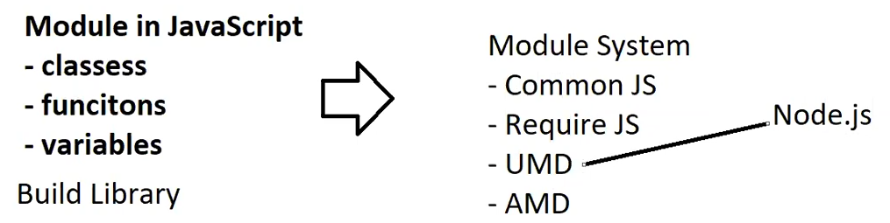

# 05. Locally installed React App

---

Previously, 

- we have used CDN’s to use React & Babel
    - These CDN’s are the links to respective Server’s
    - Hence, they require internet to connect to server & work
- But, there is another way to use these 3 Libraries [ instead of accessing via internet ]
- we can also download these React & Babel & install locally
    - `npm install react` → Installs latest React library
    - `npm install react-dom` → Installs latest ReactDOM library
    - `npm i @babel/standalone` → Installs latest Babel standalone library
    - All the above libraries command are available here → [`https://www.npmjs.com/`](https://www.npmjs.com/)

<aside>
💡

NOTE:

- Any libraries which we install directly (or) indirectly [ due to dependencies ]
- Those libraries will be copied into a folder called `node_modules`
- `node_modules` → Contains all the libraries/dependencies required to run the Project
    - `node_modules` folder gets created when we install any library
</aside>

## Modules in JS

- `module` in JS is a reusable piece of code that you can export and import
    - It consists of variables, functions & classes
- USES:
    - Modules are used to build libraries
    - Modules are used to expose & access the components outside the JS file
- But, we cannot directly use modules in JS,
    - we need a module system to use modules
        - common JS,
        - Require JS,
        - UMD [ Universal Module Distribution ],
        - AMD [ Async Module Distribution ]
    - we need to install any one of these module systems to use modules in JS
        - UMD comes by default with NodeJS  [ NO, CJS is default ]



We need to use `export` keyword to export any variable, function or class

- `export` → makes that component available/accessible to use outside the file/module

And we need an `import` keyword to import & access the exported things

- `import` → To use/access the exported components
- But for us to use any module components inside a JS file, That JS file must be declared as a Module
    - Hence, we need make the `<script>` types as `module` → `<script type='module'>`
    - Now this JS file [ which we made as a module ] can now use Module System to `import` the things

<aside>
💡

NOTE:

---

There are multiple ways to export & import in JS

- named exports → Uses `{ }`
- default exports → uses `default` keyword without `{ }`
- dynamic exports

By default, 

- JavaScript files are not modules unless explicitly treated as such (e.g., using the `type="module"` in HTML script tag or `.mjs` extension in Node.js).
</aside>

## NOTE

Since we are using Node JS, Our default module system is CJS

- But cjs files won’t work [ as browser understands umd modules ]
- Hence, we need to use libraries from `umd` folder instead of `cjs` folder
- So, use React18 instead of 19

We can configure the `ESLINT` to define

1. JS version → ES6, ES7 etc..
2. Module System → umd, cjs etc..

## 1.2 How to use React in existing web application [ using local installation ]

- Install following libraries
    - `npm install react` → Installs latest React library
    - `npm install react-dom` → Installs latest ReactDOM library
    - `npm i @babel/standalone` → Installs latest Babel standalone library
- Now include these libraries using script tag
    
    ```html
        <!-- UMD module [works] -->
         <script src="../node_modules/react/umd/react.development.js"></script>
         <script src="../node_modules/react-dom/umd/react-dom.development.js"></script>
         <script src="../node_modules/@babel/standalone/babel.js"></script>
    ```
    
- Now write react code

```jsx
<!DOCTYPE html>
<html lang="en">
<head>
    <meta charset="UTF-8">
    <meta name="viewport" content="width=device-width, initial-scale=1.0">
    <title>Main Page</title>

    <!-- CJS Module [ DOESN'T works ]
    <script src="../node_modules/react/cjs/react.development.js"></script>
    <script src="../node_modules/react-dom/cjs/react-dom.development.js"></script>
    <script src="../node_modules/@babel/standalone/babel.js"></script> -->

    <!-- UMD module [works] -->
     <script src="../node_modules/react/umd/react.development.js"></script>
     <script src="../node_modules/react-dom/umd/react-dom.development.js"></script>
     <script src="../node_modules/@babel/standalone/babel.js"></script>

    <script type="text/babel">
        const root = ReactDOM.createRoot(document.querySelector('p'))
        root.render("This message is generated using locally insatlled React")
    </script>

</head>
<body>
    <h1>Main Page</h1>
    <h3>This page is configured with React using installed Local libraries </h3>
    <p></p>
    <a href="home.html">Back to Index Page</a>
</body>
</html>
```

<aside>
💡

NOTE:

---

- Only React 18 libraries contains both cjs & umd module systems
- React 19 only contains cjs —> Hence, Doesn’t Work
    - Copying the files from cjs & pasting it in umd —> Doesn’t Work
- Hence,
    - If you’re using Node.js and have installed React via `npm` or `yarn`, you’ll need a **bundler like Webpack, Vite, Parcel, or ESBuild** to properly package your code.
    - or use older versions of React like 18.1 to get umd module system
</aside>

## 2. Creating a New React App

- we can build a Complete Empty React App using “Web Pack” (or) “vite” (or) “parcel”
    1. Using “web pack”
        
        ```bash
        # Create new React project
        npx create-react-app my-react-app
        
        # Navigate to project directory
        cd my-react-app
        
        # Start server
        npm start
        ```
        
        - But web pack is using React19,
        - Hence giving errors
    2. Using vite

```bash
# Create new Vite project
npm create vite@latest my-react-app

# Navigate to project directory
cd my-react-app

# Install dependencies
npm install

# Start dev server
npm run dev
```


## `<noscript>`

- `<noscript>` tag in HTML is used to provide/display alternative content for users who have JavaScript disabled or for browsers that don't support JavaScript.

**How It Works**

- If JavaScript **is enabled**, the content inside `<noscript>` is IGNORED
- If JavaScript **is disabled**, the content inside `<noscript>` is DISPLAYED

---

## what is "--save" during package installation

- The `--save` flag was used to add the package as a dependency in the `package.json` file when installing packages.
- This is used in Older Versions of npm
- But after npm V5, it is made as default
- So No need to specify the tag `--save` explicitly, npm by default adds any new dependency in the `package.json` file

## Module System in JS

- **`module system`** is a way to organize and encapsulate code into **separate files** (or "modules") so as to Re-Use the code Efficiently
- It gives us the functionality of `import` & `export` from one file/module to another
- Instead of writing everything in a single file,
    - you can split your code into multiple files (modules) and import only what you need.

Types of Module Systems:

1. **CommonJS (CJS)** 
    - Default in **Node.js** (prior to ES module support).
    - Modules are loaded synchronously.
    - You use `require()` to import modules and `module.exports` to export.
2. **ES Modules (ESM)** 
    - Standard for modern JavaScript [ Introduced in ES6 ]
    - Uses `import` and `export` syntax.
    - Works asynchronously, making it suitable for browsers.
    - Supported in modern browsers and in Node.js (with `.mjs` extension or `"type": "module"` in `package.json`).
3. **UMD (Universal Module Definition)**:
    - Supports both CommonJS and AMD (used in browsers).
    - Useful for creating libraries that work everywhere.

NOTE:

- The **AMD (Asynchronous Module Definition)** module system is a pattern designed for loading JavaScript modules asynchronously in a browser environment.
- AMD is often implemented using **RequireJS**, [ a JavaScript library that helps manage module dependencies ]
- AMD was widely used in front-end development before **ES Modules (ESM)** became the standard

### Why Modules Matter

- Encourage **modular, Scalable & maintainable code**.
- Enable **code reuse** across projects.
- Help in **tree shaking** (removing unused code) during bundling.

| Feature | ES Modules (ESM) | CommonJS (CJS) |
| --- | --- | --- |
| Syntax | `import/export` | `require/module.exports` |
| When loaded | Static (at parse time) | Dynamic (at runtime) |
| Browser support | Yes | No (without bundling) |
| Node.js support | Yes (with config) | Yes (default) |
| Execution | Async | Synchronous |
| Run Mode | Runs in Strict Mode | Runs in Non-Strict Mode |
| Extension | `.cjs` | `.mjs` |
| type | `type: "commonjs"` | `type: "module"` |

## `npm` vs `npx`

- `npm` → Node Package Manager
    - It is a Tool used to install, update, manage, delete & publish Software Packages
- `npx` → Node Package Executor
    - It runs a package without installing it globally.
        - It doesn’t installs the package, It just runs/executes the package
        - It doesn’t adds the dependencies to `package.json` file
- **When to Use What?**
    - Use `npm` when you need a package **installed** and **maintained** in your project.
    - Use `npx` when you just want to quickly **run** a package without installing it globally.

## **Benefits of Ignoring `node_modules`**

- **Size**: The **`*node_modules*`** folder can become very large, often containing thousands of files
- **Redundancy**: Dependencies are defined in **`*package.json*`** and can be installed using **`*npm install*`**, so they don’t need to be tracked in version control
- **Performance**: Ignoring **`*node_modules*`** reduces the size of your repository, making cloning and fetching faster
- How to add in gitignore file —> `node_modules/`